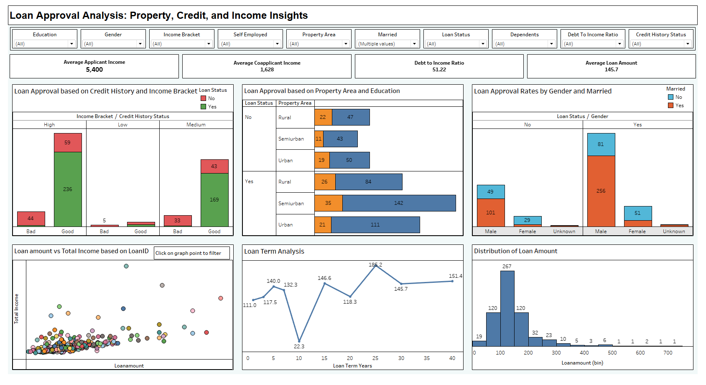
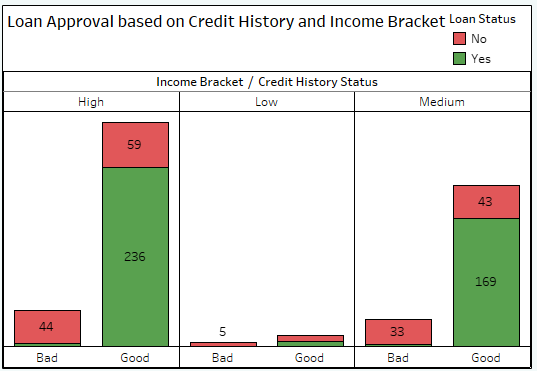
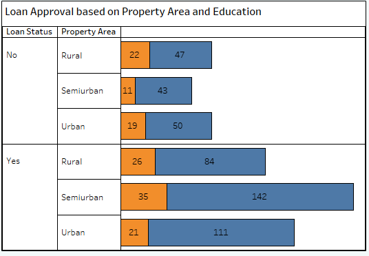
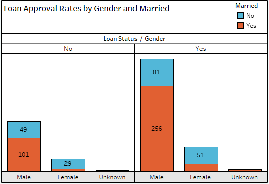
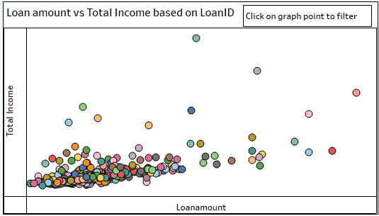
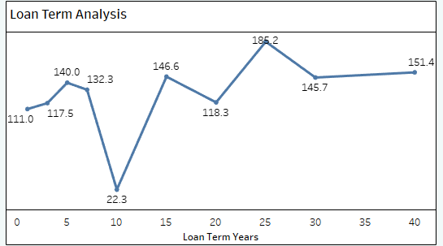
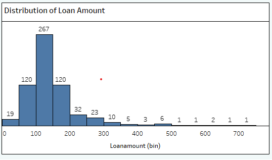

# Loan Approval Analysis: Property, Credit, and Income Insights

## Overview
This project analyzes the key factors influencing loan approvals using SQL for data processing and Tableau for visualization. The objective is to provide financial institutions with actionable insights into how demographic, income, and credit factors affect loan decisions.

## Table of Contents
1. [Project Background](#project-background)
2. [Files in the Repository](#files-in-the-repository)
3. [SQL Commands Breakdown](#sql-commands-breakdown)
4. [Dashboard Components](#dashboard-components)
5. [Running the Project](#running-the-project)
6. [Results and Conclusions](#results-and-conclusions)
7. [Challenges and Future Work](#challenges-and-future-work)
8. [Licensing](#licensing)
9. [Contributions](#contributions)

## Project Background
The goal of this project is to analyze and visualize the various factors that influence loan approval rates. By understanding these dynamics, financial institutions can refine their lending criteria, enhance customer targeting, and minimize default risks.

## Files in the Repository
- **SQL Scripts:**
  - `Importing dataset.sql`: Script for importing the dataset into PostgreSQL.
  - `Table Creation.sql`: Script for creating tables to store the dataset.
  - `Data Cleaning.sql`: Script for cleaning and preparing the data.
  - `Feature Engineering.sql`: Script for creating additional features for analysis.
  - `Initial EDA.sql`: Script for exploratory data analysis.
  - `Data Analysis.sql`: Script for detailed analysis of loan approval factors.

- **Data Files:**
  - `loan_prediction.csv`: Raw dataset used for the analysis.

- **Tableau Files:**
  - `Loan Approval Analysis - Property, Credit and Income Insights.twbx`: Packaged Tableau workbook.

- **Dashboard Image:**
  - `Loan Approval Dynamics: Property, Credit, and Income Insights.png`: Image of the final Tableau dashboard.

## SQL Commands Breakdown

### 1. Importing the Dataset
**File:** `Importing dataset.sql`  
**Description:** Imports the `loan_prediction.csv` file into PostgreSQL, ensuring accurate data types and initial setup.

### 2. Table Creation
**File:** `Table Creation.sql`  
**Description:** Defines the structure of the tables to hold the loan data, tailored for efficient storage and retrieval.

### 3. Data Cleaning
**File:** `Data Cleaning.sql`  
**Description:** Cleans the dataset by handling missing values, duplicates, and inconsistencies using SQL functions like `COALESCE` and `PERCENTILE_CONT`.

### 4. Feature Engineering
**File:** `Feature Engineering.sql`  
**Description:** Enhances the dataset by adding calculated features such as `Debt_to_Income_Ratio`, providing deeper insights for analysis.

### 5. Initial EDA
**File:** `Initial EDA.sql`  
**Description:** Conducts preliminary analysis to understand data distributions, identify trends, and prepare for more detailed exploration.

### 6. Data Analysis
**File:** `Data Analysis.sql`  
**Description:** Analyzes how demographic and financial factors impact loan approval rates, offering insights into potential biases and risk factors.

## Dashboard Components

### 1. Loan Approval Based on Credit History and Income Bracket

**Insight:** Highlights the critical role of credit history and income levels in loan decisions.

### 2. Loan Approval Based on Property Area and Education

**Insight:** Reveals demographic patterns in loan approvals across different property areas and education levels.

### 3. Loan Approval Rates by Gender and Marital Status

**Insight:** Explores potential biases in loan approvals related to gender and marital status.

### 4. Loan Amount vs. Total Income

**Insight:** Displays the relationship between total income and loan amount, helping to identify trends and outliers.

### 5. Loan Term Analysis

**Insight:** Analyzes how the loan amount varies with different loan terms, providing insights into borrower preferences.

### 6. Distribution of Loan Amount

**Insight:** Shows the distribution of loan amounts, highlighting common loan sizes and outliers.

## Running the Project
1. **Set Up PostgreSQL Database:**
   - Import the dataset using `Importing dataset.sql`.
   - Create tables with `Table Creation.sql`.
   - Clean and prepare the data using the remaining SQL scripts in sequence.

2. **Open the Tableau Dashboard:**
   - Load the `Loan Approval Analysis - Property, Credit and Income Insights.twbx` file in Tableau.
   - Explore the dashboard using the filters and interactive elements to gain insights.

## Results and Conclusions
This analysis demonstrates that credit history, income bracket, and demographics significantly influence loan approval decisions. By using these insights, financial institutions can optimize their lending strategies to better serve diverse customer segments and minimize risks.

## Challenges and Future Work
### Challenges:
- Handling missing values in key features without introducing bias.
- Ensuring accurate feature engineering to enhance model performance.

### Future Work:
- Expanding the analysis to include other demographic factors.
- Applying machine learning techniques to predict loan approval.
